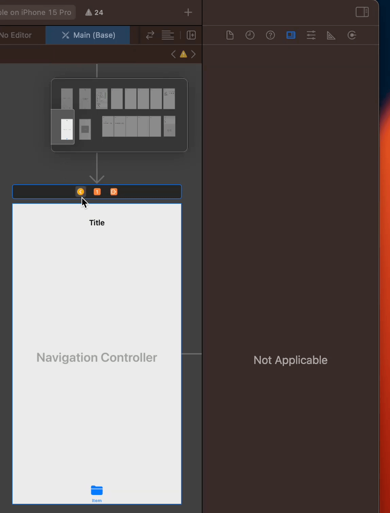
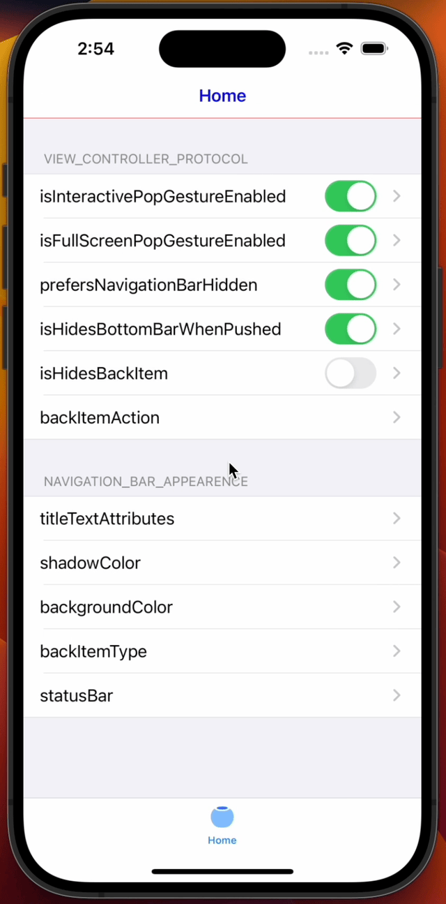
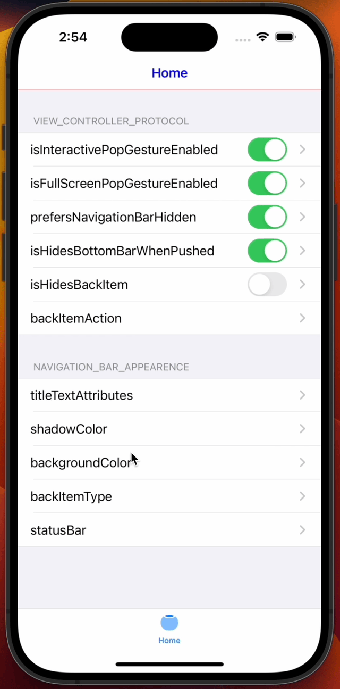
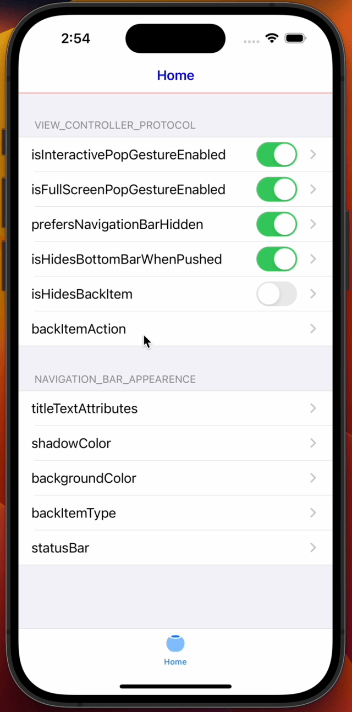
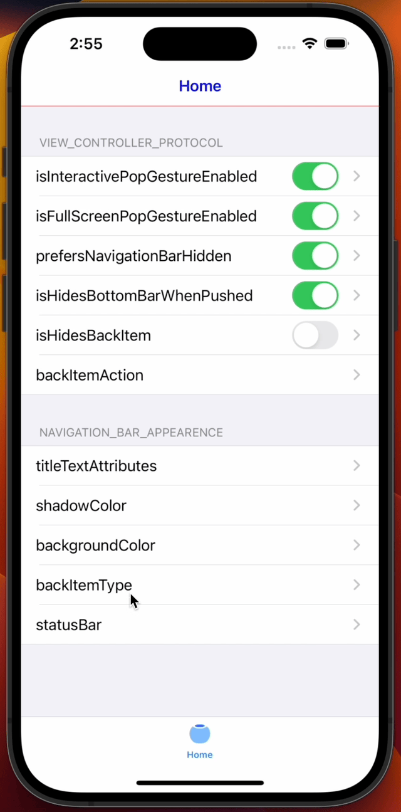
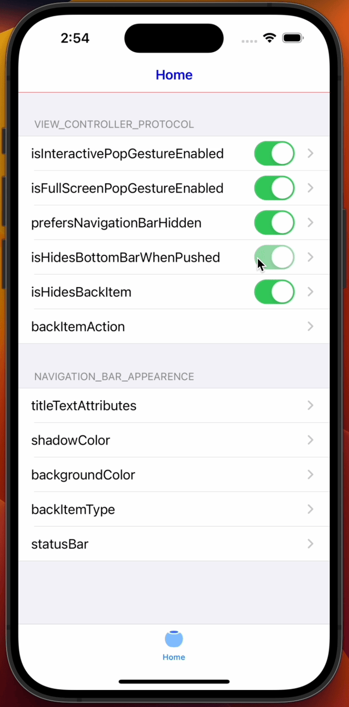
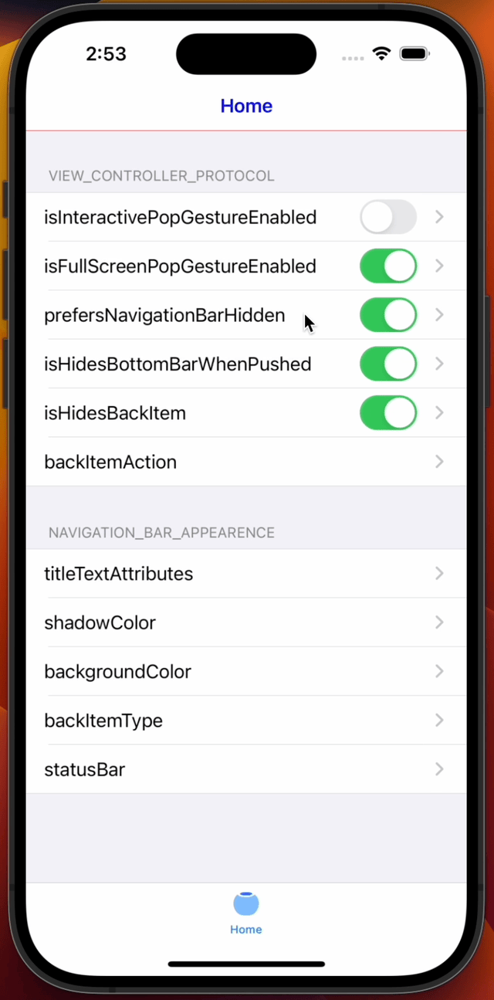
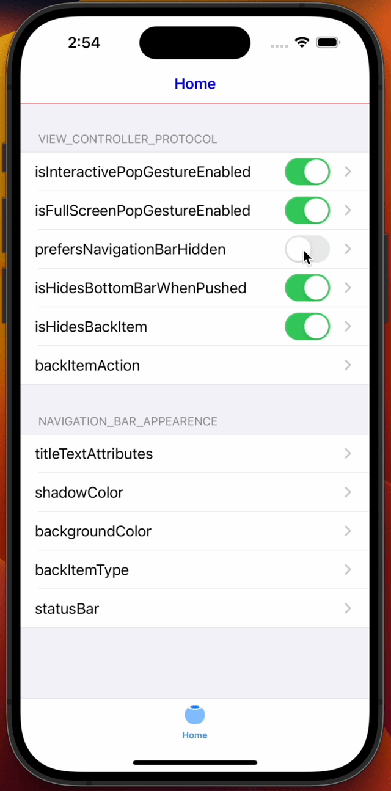

# YDRootNavigationController

[](https://travis-ci.org/heroyoungday/YDRootNavigationController)
[](https://cocoapods.org/pods/YDRootNavigationController)
[](https://cocoapods.org/pods/YDRootNavigationController)
[](https://cocoapods.org/pods/YDRootNavigationController)

## Overview

* Supports setting a globally unified default navigation bar style (for example: backgroundColor, shadowColor, title textAttributes), and supports each view controller to customize the navigation bar style.
* Support global default settings to enable the system's own pop gesture, and support the view controller's own default settings and dynamic settings.
* Support global default setting whether to enable full-screen pop gesture, and support the view controller's own default setting and dynamic setting.
* Support global default settings for whether to display the backBarItem, as well as support for the view controller's own default settings and dynamic settings.
* Support global default settings for whether to display the navigation bar, and support the view controller's own default settings and dynamic settings.
* Support global default settings for whether to display the tab bar, and support the view controller's own default settings and dynamic settings.
* Support setting status bar style and showing hidden status.
* Support custom backBarItem.
* Support customizing the click event of the backBarItem.
* Support `Interface Builder`.


* 支持设置全局统一默认的导航栏样式（例如：导航栏背景颜色、底部分割线颜色、标题文字属性），同时支持每个视图控制器可以自定义导航栏样式
* 支持全局默认设置是否开启系统自带的返回手势，同时支持视图控制器自己默认设置和动态设置
* 支持全局默认设置是否开启全屏返回手势，同时支持视图控制器自己默认设置和动态设置
* 支持全局默认设置是否显示返回按钮，同时支持视图控制器自己默认设置和动态设置
* 支持全局默认设置是否显示导航栏，同时支持视图控制器自己默认设置和动态设置
* 支持全局默认设置是否显示标签栏，同时支持视图控制器自己默认设置和动态设置
* 支持设置状态栏样式和显示隐藏状态
* 支持自定义返回按钮
* 支持自定义返回按钮的点击事件
* 支持`Interface Builder`

## Requirements

* **iOS 12** and up
  
## Installation

YDRootNavigationController is available through [CocoaPods](https://cocoapods.org). To install
it, simply add the following line to your Podfile:

```ruby
pod 'YDRootNavigationController'
```
## Usage
* 全局默认样式配置（Global default style configuration）

1.创建一个类用来实现YDAppAppearanceProtocol协议
```swift
class MyAppAppearance: YDAppAppearanceProtocol {
    var navigationBarBackgroundColor: UIColor? { .white }
    var navigationBarShadowColor: UIColor? { .clear }
    var titleTextAttributes: [NSAttributedString.Key : Any]? { [NSAttributedString.Key.foregroundColor: UIColor.blue] }
    var backItemImage: UIImage? { UIImage(named: "nav_back_black_button") }
    var backItemImageInsets: UIEdgeInsets? { UIEdgeInsets(top: 0, left: -6, bottom: 0, right: 0) }
}

```
2.在AppDelegate中调用
```swift
func application(_ application: UIApplication, didFinishLaunchingWithOptions launchOptions: [UIApplicationLaunchOptionsKey: Any]?) -> Bool {
        // 全局默认样式配置
        MyAppAppearance().configure()
        return true
    }
}
```
* 视图控制器自定义样式配置（View controller custom style configuration）

1.导航栏控制器设置为YDRootNavigationController或继承YDRootNavigationController的类
-代码
```swift
func application(_ application: UIApplication, didFinishLaunchingWithOptions launchOptions: [UIApplicationLaunchOptionsKey: Any]?) -> Bool {
    self.window?.rootViewController = YDRootNavigationController()
    return true
}
```
-`Interface Builder`设置

1.导航栏样式配置





2.自定义返回按钮点击事件
```swift
class ViewController: UIViewController {
    override func backItemAction(_ sender: Any?) {
        let alert = UIAlertController(title: "提示", message: "是否确定退出？", preferredStyle: .alert)
        alert.addAction(UIAlertAction(title: "确定", style: .default, handler: { [weak self] action in
            self?.navigationController?.popViewController(animated: true)
        }))
        alert.addAction(UIAlertAction(title: "取消", style: .default))
        present(alert, animated: true)
    }
}
```

3.自定义返回按钮
```swift
class ViewController: UIViewController {
    override var isHidesBackItem: Bool { true }
}
```

4.返回按钮隐藏
```swift
class ViewController: UIViewController {
    override var isHidesBackItem: Bool { true }
}
```


* 原生返回手势（Native pop gesture）
```swift
class ViewController: UIViewController {
    // 默认设置
    override var isInteractivePopGestureEnabled: Bool { interactivePopGesture }
    var interactivePopGesture: Bool = true {
        didSet {
            // 动态设置
            interactivePopGesture(interactivePopGesture)
        }
    }
}
```

* 全屏返回手势（Full Screen pop gesture）
```swift
class ViewController: UIViewController {
    // 默认设置
    override var isFullScreenPopGestureEnabled: Bool { fullScreenPopGesture }
    var fullScreenPopGesture: Bool = true {
        didSet {
            // 动态设置
            fullScreenPopGesture(fullScreenPopGesture)
        }
    }
}
```

* 导航栏隐藏（Navigation bar hidden）
```swift
class ViewController: UIViewController {
    override var prefersNavigationBarHidden: Bool { true }
}
```

* `push`时标签栏隐藏（is Hides Bottom Bar When Pushed）
```swift
class ViewController: UIViewController {
    override var isHidesBottomBarWhenPushed: Bool { true }
}
```


* 状态栏设置（Status bar settings）
```swift
class ViewController: UIViewController {
    override var preferredStatusBarStyle: UIStatusBarStyle { .default }
    override var preferredStatusBarUpdateAnimation: UIStatusBarAnimation { .none }
    override var prefersStatusBarHidden: Bool { false }
}
```


## Author

jsone, heroyoungday@gmail.com

## License

YDRootNavigationController is available under the MIT license. See the LICENSE file for more info.
